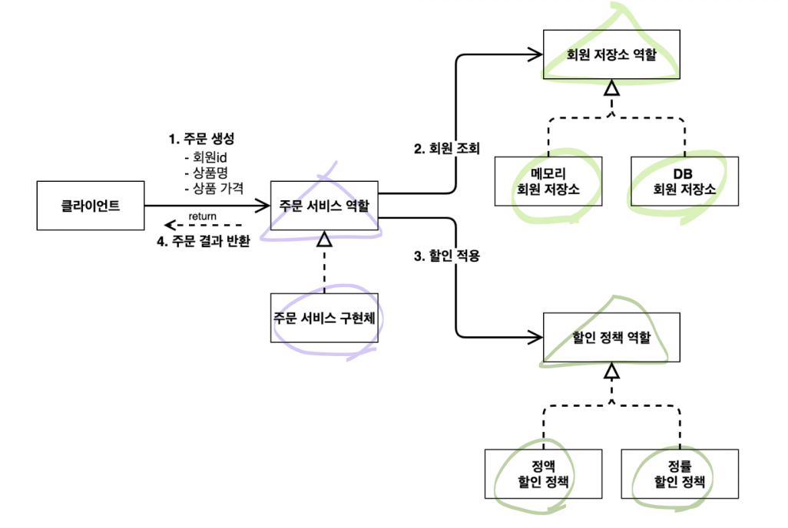
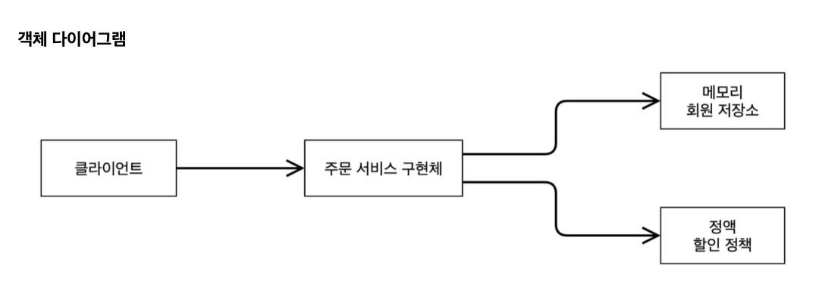
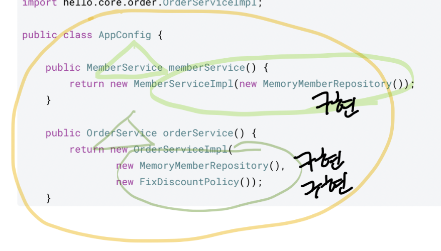
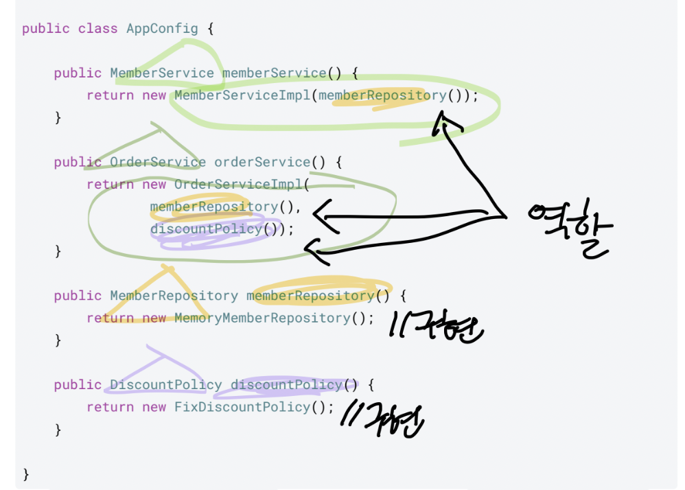

# 좋은 객체 지향 설계의 5가지 원칙 (SOLID)
## SOLID
클린코드로 유명한 로버트 마틴이 좋은 객체 지향 설계의 5가지 원칙을 정리
- SRP: 단일 책임 원칙(single responsibility principle)
- OCP: 개방-폐쇄 원칙 (Open/closed principle)
- LSP: 리스코프 치환 원칙 (Liskov substitution principle)
- ISP: 인터페이스 분리 원칙 (Interface segregation principle)
- DIP: 의존관계 역전 원칙 (Dependency inversion principle)

----

## SRP 단일 책임 원칙
Single responsibility principle
- 한 클래스는 하나의 책임만 가져야 한다.
- 하나의 책임이라는 것은 모호하다.
- 클 수 있고, 작을 수 있다.
- 문맥과 상황에 따라 다르다.
- 중요한 기준은 변경이다. 변경이 있을 때 파급 효과가 적으면 단일 책임 원칙을 잘 따른 것
- 예) UI 변경, 객체의 생성과 사용을 분리

----
## OCP 개방-폐쇄 원칙
Open/closed principle
- 소프트웨어 요소는 확장에는 열려 있으나 변경에는 닫혀 있어야 한다
- 이런 거짓말 같은 말이? 확장을 하려면, 당연히 기존 코드를 변경?
- 다형성을 활용해보자
- 인터페이스를 구현한 새로운 클래스를 하나 만들어서 새로운 기능을 구현
- 지금까지 배운 역할과 구현의 분리를 생각해보자

### 문제점
- MemberService 클라이언트가 구현 클래스를 직접 선택
- MemberRepository m = new MemoryMemberRepository(); //기존 코드
- MemberRepository m = new JdbcMemberRepository(); //변경 코드
- 구현 객체를 변경하려면 클라이언트 코드를 변경해야 한다.
- 분명 다형성을 사용했지만 OCP 원칙을 지킬 수 없다.

### 어떻게 해결해야 하나?
- 객체를 생성하고, 연관관계를 맺어주는 별도의 조립, 설정자가 필요하다.

----
## LSP 리스코프 치환 원칙
Liskov substitution principle
- 프로그램의 객체는 프로그램의 정확성을 깨뜨리지 않으면서 하위 타입의 인스턴스로 바꿀 수 있어야 한다
- 다형성에서 하위 클래스는 인터페이스 규약을 다 지켜야 한다는 것, 다형성을 지원하기 위한 원칙, 인터페이스를 구현한 구현체는 믿고 사용하려면, 이 원칙이 필요하다.
- 단순히 컴파일에 성공하는 것을 넘어서는 이야기
- 예) 자동차 인터페이스의 엑셀은 앞으로 가라는 기능, 뒤로 가게 구현하면 LSP 위반, 느리더라도 앞으로 가야함

----
## ISP 인터페이스 분리 원칙
Interface segregation principle
- 특정 클라이언트를 위한 인터페이스 여러 개가 범용 인터페이스 하나보다 낫다
- 자동차 인터페이스 -> 운전 인터페이스, 정비 인터페이스로 분리
- 사용자 클라이언트 -> 운전자 클라이언트, 정비사 클라이언트로 분리
- 분리하면 정비 인터페이스 자체가 변해도 운전자 클라이언트에 영향을 주지 않음
- 인터페이스가 명확해지고, 대체 가능성이 높아진다.

----
## DIP 의존관계 역전 원칙
Dependency inversion principle
- 프로그래머는 “추상화에 의존해야지, 구체화에 의존하면 안된다.” 의존성 주입은 이 원칙을 따르는 방법 중 하나다.
- 쉽게 이야기해서 구현 클래스에 의존하지 말고, 인터페이스에 의존하라는 뜻
- 앞에서 이야기한 역할(Role)에 의존하게 해야 한다는 것과 같다. 객체 세상도 클라이언트가 인터페이스에 의존해야 유연하게 구현체를 변경할 수 있다! 구현체에 의존하게 되면 변경이 아주 어려워진다.

## 문제점
- 그런데 OCP에서 설명한 MemberService는 인터페이스에 의존하지만, 구현 클래스도 동시에 의존한다.
- MemberService 클라이언트가 구현 클래스를 직접 선택
- MemberRepository m = new MemoryMemberRepository();
- DIP 위반
- java만으로는 SOLID 원칙을 준수하기 어렵다

----
## 정리
- 객체 지향의 핵심은 다형성
- 다형성 만으로는 쉽게 부품을 갈아 끼우듯이 개발할 수 없다.
- 다형성 만으로는 구현 객체를 변경할 때 클라이언트 코드도 함께 변경된다.
- 다형성 만으로는 OCP, DIP를 지킬 수 없다.
- 뭔가 더 필요하다.

----
이 내용은 매우 중요하다. 역할에 집중해야한다. 구체에 집중하면 안된다.
따라서 조직에서도 역할에 맞는 인터페이스를 설정하고, 구현체는 언제나 바꿀 수 있도록 해야한다.

---
## 팀원과 대화에서 얻은 insight
1. single responsibility principle 를 제외한 나머지 규칙은 interface 내용이다
2. interface를 설계하는 것이 개발을 잘하게 되는 것이 아닐까?
3. abstract class는 요즘 사용을 덜하는가?

### 1. Interface 중심 설계와 개발 역량
Single Responsibility Principle(SRP)을 제외한 나머지 SOLID 원칙들(OCP, LSP, ISP, DIP)은 대부분 interface와의 관계를 강조합니다.
즉, interface가 잘 설계되어야 자연스럽게 OCP(개방-폐쇄 원칙), ISP(인터페이스 분리 원칙), DIP(의존 역전 원칙)을 지킬 수 있게 됩니다.

#### 예시
- OCP: 기존 코드를 수정하지 않고도 기능 확장 가능 → interface 기반으로 확장 클래스 추가
- ISP: 하나의 거대한 interface 대신 역할별로 세분화된 interface 제공
- DIP: 고수준 모듈이 구체 클래스가 아니라 interface에 의존

그래서 interface를 잘 설계하는 것은 단순히 문법 문제가 아니라, 변화에 강한 시스템을 만드는 핵심 역량이라고 할 수 있습니다.
한마디로, “클래스 구현보다 interface 설계가 훨씬 중요하다”

### 2. 변화에 유연하고 확장 가능한 아키텍처를 설계
- 개발 실력을 키우려면 단순히 코드를 잘 짜는 것보다 interface 설계 능력을 우선 키우는 것이 중요
- SOLID 원칙 중 **SRP + 인터페이스 관련 3원칙(ISP, DIP, OCP)**를 깊게 이해해야 합니다
- abstract class는 요즘 줄어드는 추세지만, 여전히 상속 기반의 공통 로직 제공이나 템플릿 메서드 패턴 같은 곳에서 중요한 역할을 합니다.

### 3. Abstract Class와 Interface의 사용 경향
- interface → 시스템의 방향과 확장성을 결정하는 설계의 뼈대
- abstract class → 공통 구현을 묶는 강한 결합의 기반

- 최근의 개발 트렌드에서 abstract class는 사용 빈도가 줄어드는 편입니다. 그 이유는 다음과 같습니다.

| 구분        | Abstract Class        | Interface                    |
| --------- | --------------------- | ---------------------------- |
| **다중 상속** | 불가능 (extends는 1개만 가능) | 가능 (implements 여러 개 가능)      |
| **기본 구현** | 일부 메서드 구현 가능          | Java 8 이후 default 메서드 제공 가능  |
| **역할**    | "IS-A" 관계, 공통 기능 제공   | "CAN-DO" 관계, 계약(Contract) 정의 |
| **확장성**   | 확장시 제약 많음             | 확장 유연성이 높음                   |

#### 최근 트렌드:
- 과거에는 abstract class가 공통 코드 재사용 목적으로 많이 쓰였지만,
- 지금은 default method를 가진 interface가 등장하면서 그 자리를 많이 대체하고 있습니다.

- 특히 Spring, NestJS 같은 프레임워크는 대부분 interface를 중심으로 구조를 잡고,
- 실제 구현체는 별도로 만들어 주입(DI)하는 패턴을 선호합니다.

- 다만, 상태(state)나 강한 공통 동작이 필요한 경우에는 여전히 abstract class를 사용합니다.

#### 예시
- abstract class BaseEntity → id, createdAt 같은 공통 필드 및 로직 제공
- interface Repository → CRUD 메서드 시그니처 정의, 구현은 다른 곳에서 담당

### Abstract Class가 Interface의 "일부분"처럼 보이는 이유
- interface는 “무조건 지켜야 하는 계약”
-  abstract class는 “기본 구현 + 선택적 확장”

#### 비슷하다고 기억하는 이유는?
- Java 8 이후 interface에 default method와 static method가 추가되면서,
- interface도 일부 구현을 가질 수 있게 되었습니다.
- 이로 인해 두 개념이 비슷하게 느껴지게 된 것입니다.

- 인터페이스의 역할은 *“무조건 구현해야 하는 규칙을 정의”*하는 것이고,
- 추상 클래스도 "일부 추상 메서드를 정의"하기 때문에 인터페이스와 비슷한 기능을 합니다.

#### 차이점
- 인터페이스는 다중 구현 가능
- 추상 클래스는 상속은 단일만 가능

- 인터페이스는 상태(state)를 가질 수 없지만
- 추상 클래스는 **공통 상태(필드)**를 가질 수 있음

---
## IoC, DI, 그리고 컨테이너
### 제어의 역전 IoC(Inversion of Control)
- 기존 프로그램은 클라이언트 구현 객체가 스스로 필요한 서버 구현 객체를 생성하고, 연결하고, 실행했다. 한마디로 구현 객체가 프로그램의 제어 흐름을 스스로 조종했다. 개발자 입장에서는 자연스러운 흐름이다.
- 반면에 AppConfig가 등장한 이후에 구현 객체는 자신의 로직을 실행하는 역할만 담당한다. 프로그램의 제어 흐름은 이제 AppConfig가 가져간다. 예를 들어서 `OrderServiceImpl` 은 필요한 인터페이스들을 호출하지만 어떤 구현 객체들이 실행될지 모른다.
- 프로그램에 대한 제어 흐름에 대한 권한은 모두 AppConfig가 가지고 있다. 심지어 `OrderServiceImpl`도 AppConfig가 생성한다. 그리고 AppConfig는 `OrderServiceImpl` 이 아닌 OrderService 인터페이스의 다른 구현 객체를 생성하고 실행할 수 도 있다. 그런 사실도 모른체 `OrderServiceImpl` 은 묵묵히 자신의 로직
을 실행할 뿐이다.
- 이렇듯 프로그램의 제어 흐름을 직접 제어하는 것이 아니라 외부에서 관리하는 것을 제어의 역전(IoC)이라 한다.

#### 프레임워크 vs 라이브러리
- **프레임워크가 내가 작성한 코드를 제어하고**, **대신 실행**하면 그것은 프레임워크가 맞다. (JUnit)
- 반면에 내가 작성한 코드가 **직접 제어의 흐름을 담당한다면** 그것은 프레임워크가 아니라 라이브러리다.

---
## DIP 원칙을 지키는 방법: DI
- 의존관계 주입 DI(Dependency Injection)
- `OrderServiceImpl` 은 `DiscountPolicy` 인터페이스에 의존한다. 실제 어떤 구현 객체가 사용될지는 모른다.
- 의존관계는 두 경우를 분리해서 생각해야한다
  1) 정적인 클래스 의존 관계
  2) 실행 시점에 결정되는 동적인 객체(인스턴스) 의존 관계

### 정적인 클래스 의존관계

- 클래스가 사용하는 import 코드만 보고 의존관계를 쉽게 판단할 수 있다. 정적인 의존관계는 애플리케이션을 실행하지 않아도 분석할 수 있다.
`OrderServiceImpl` 은 `MemberRepository` , `DiscountPolicy` 에 의존한다는 것을 알 수 있다.
그런데 이러한 클래스 의존관계 만으로는 실제 어떤 객체가 `OrderServiceImpl` 에 주입 될지 알 수 없다.

### 동적인 객체 인스턴스 의존 관계
애플리케이션 실행 시점에 실제 생성된 객체 인스턴스의 참조가 연결된 의존 관계다.

## IoC Container == DI Container == Assembler == Object Factory
- AppConfig 처럼 객체를 생성하고 관리하면서 의존관계를 연결해 주는 것을 IoC 컨테이너 또는 **DI 컨테이너**라 한다.
- 의존관계 주입에 초점을 맞추어 최근에는 주로 DI 컨테이너라 한다.
- 또는 어샘블러, 오브젝트 팩토리 등으로 불리기도 한다.

### AppConfig 리팩터링
- 구성 정보에서 역할과 구현을 명확하게 분리
- 역할이 잘 드러남
- 중복 제거

- 더 이상 클라이언트 코드는 구체에 의존하지 않는다. 그저 AppConfig가 주입을 해주고 있다.
- DI Container